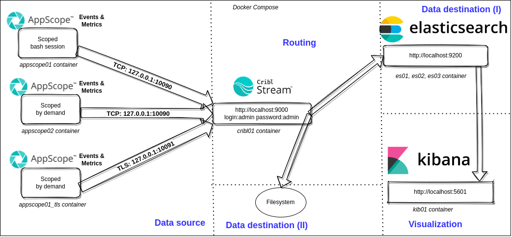
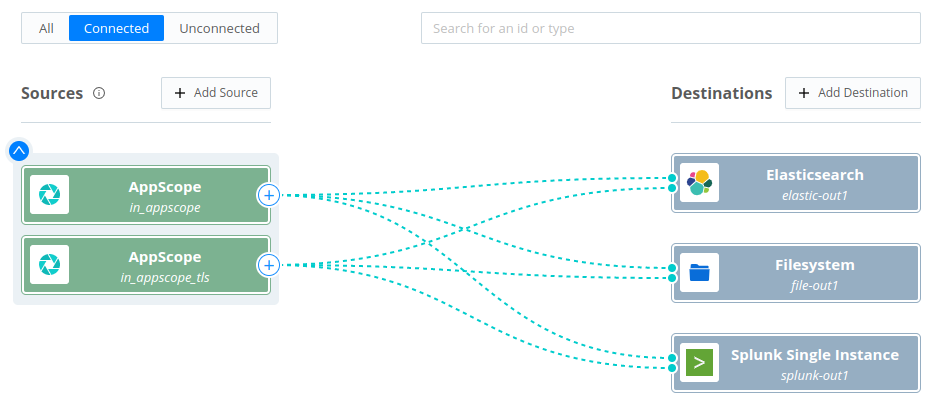

<h1> elastified-appscope </h1>

This demo uses Kibana to visualize data collected with [AppScope](https://github.com/criblio/appscope), an open source, runtime-agnostic instrumentation utility for any Linux command or application.

**Contents**

- [Prerequisites](#prerequisites)
- [Overview](#overview)
- [Cribl Stream configuration](#cribl-stream-configuration)
- [Preparation](#preparation)
  - [Building](#building)
  - [Testing](#testing)
- [Using the demo](#using-the-demo)
  - [Scoping the bash session](#scoping-the-bash-session)
  - [Scoping an individual command](#scoping-an-individual-command)
- [Cleaning up after a session](#cleaning-up-after-a-session)

## Prerequisites
For this demo environment, you will need Docker, `bash`, `openssl` and `curl`.

## Overview

This demo environment uses:

- [AppScope](https://appscope.dev/) to instrument applications running in the demo environment.
- [Cribl Stream](https://cribl.io/stream/) as a agent.
- [Elasticsearch](https://www.elastic.co/Elasticsearch/) to store data. 
- [Kibana](https://www.elastic.co/products/kibana) to visualize metrics and events. 

By default, the services will be available at the following URLs:

|Service|URL|
|-------|---|
|Cribl Stream|[http://localhost:9000](http://localhost:9000)|
|Elasticsearch|[http://localhost:9200](http://localhost:9200)|
|Kibana|[http://localhost:5601](http://localhost:5601)|

If you want to modify these settings, edit the `.env` file.

The diagram below depicts the demo cluster.


## Cribl Stream configuration

The diagram below depicts the Cribl Stream configuration.


## Preparation

The demo provides two interfaces, each of which runs in its own Docker container:

- `appscope01` for scoping an entire bash session using TCP connection.
- `appscope02` for scoping an individual command using TCP connection.
- `appscope01_tls` for scoping an individual command using TLS Secure Connections.

You can opt to use a fourth interface, which simply runs AppScope on the host in the usual way (without running a Docker container). 

If this is your desired option, you must configure a Cribl Stream port to receive data from AppScope. Note that Cribl Stream _is_ running in its own Docker container, named `cribl01`.

To do this, edit the `docker-compose.yml` to match the following:

```
  cribl01:
    ...
    ports:
      - "${CRIBL_HOST_PORT:-9000}:9000"
      - 10070:10070
      - 10071:10071
```

What this does is exposed ports `10070` and `10071` to the host. The ports can be used to send data by AppScope
(running on host):
- for TCP `tcp://127.0.0.1:10070`
- for TLS `tcp://127.0.0.1:10071` see [setup details](https://appscope.dev/docs/tls/#using-tls-for-secure-connections)

CA certificate file:`domain.crt` is automatically generated by `./start.sh` script.

### Building

To build the demo:

```bash
./start.sh
```

### Testing

To confirm that everything works correctly:

```bash
docker ps
```

You should see results similar to this:

```bash
CONTAINER ID   IMAGE                                                  COMMAND                  CREATED         STATUS         PORTS                                                 NAMES
76af61bde578   cribl/scope:1.0.4                                      "bash"                   4 seconds ago   Up 2 seconds                                                         appscope01_tls
1282f039efd9   cribl/scope:1.0.4                                      "bash"                   4 seconds ago   Up 2 seconds                                                         appscope02
b7611e8bdfe9   docker.elastic.co/elasticsearch/elasticsearch:7.17.0   "/bin/tini -- /usr/l…"   4 seconds ago   Up 2 seconds   9200/tcp, 9300/tcp                                    es03
c8e5d96b909f   cribl/cribl:3.4.1                                      "/sbin/entrypoint.sh…"   4 seconds ago   Up 2 seconds   0.0.0.0:9000->9000/tcp, :::9000->9000/tcp             cribl01
4a4da91d6562   docker.elastic.co/elasticsearch/elasticsearch:7.17.0   "/bin/tini -- /usr/l…"   4 seconds ago   Up 2 seconds   9200/tcp, 9300/tcp                                    es02
f171487fbf47   docker.elastic.co/kibana/kibana:7.17.0                 "/bin/tini -- /usr/l…"   4 seconds ago   Up 2 seconds   0.0.0.0:5601->5601/tcp, :::5601->5601/tcp             kib01
b5137275cb38   docker.elastic.co/elasticsearch/elasticsearch:7.17.0   "/bin/tini -- /usr/l…"   4 seconds ago   Up 2 seconds   0.0.0.0:9200->9200/tcp, :::9200->9200/tcp, 9300/tcp   es01
```

## Using the demo

This section covers how to run the `appscope01`, `appscope02` and `appscope01_tls` containers; no special instructions are needed for the fourth option, of running AppScope on the host in the usual way.

### Scoping the bash session

Connect to the `appscope01` container:

```bash
docker-compose run appscope01
```

Every command that you run in the bash session will be scoped.

### Scoping an individual command

Connect to the `appscope02` container and run the desired command:

```bash
docker exec -it appscope02 bash
ldscope <command>
```

Connect to the `appscope01_tls` container and run the desired command:

```bash
docker exec -it appscope01_tls bash
ldscope <command>
```

## Cleaning up after a session 

To clean up the demo environment:

```bash
./stop.sh
```

By default, Elasticsearch stores the data in `/Elasticsearch/data` using `docker volume`. 

To clean it up:

```bash
docker volume prune
```

To clean up Cribl data (i.e., data from Cribl Stream) that the Elasticsearch backend has stored: 

- Open the Kibana [console](https://www.elastic.co/guide/en/kibana/current/console-kibana.html).

- In your Cribl Stream Elasticsearch Destination, note the [value](https://docs.cribl.io/stream/destinations-elastic/#general-settings) you have under **General Settings** > **Index or data stream**. Substitute this value for `<index_or_data_stream>` in the example below, and run the query:

```
DELETE <index_or_data_stream>
```

What this does is to send a request to the Kibana [Delete objects API](https://www.elastic.co/guide/en/kibana/current/saved-objects-api-delete.html).
